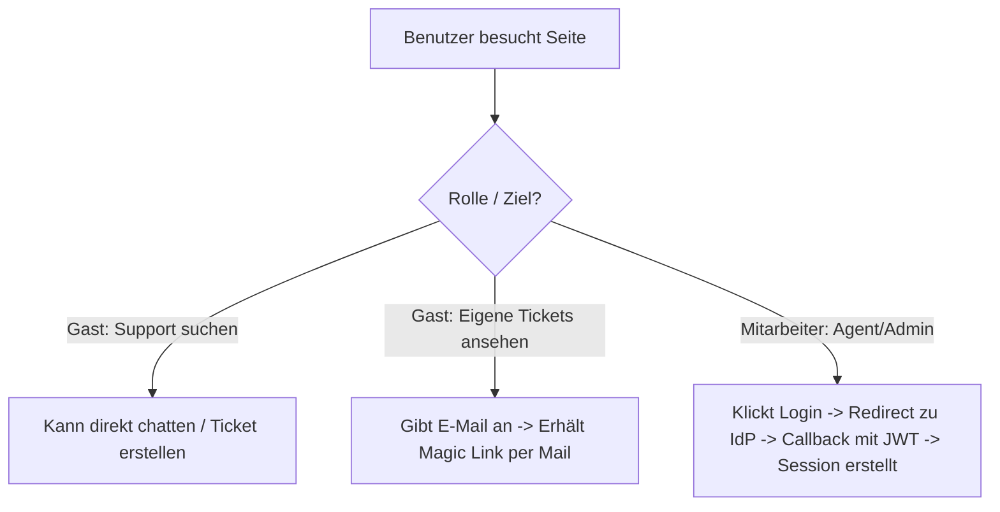
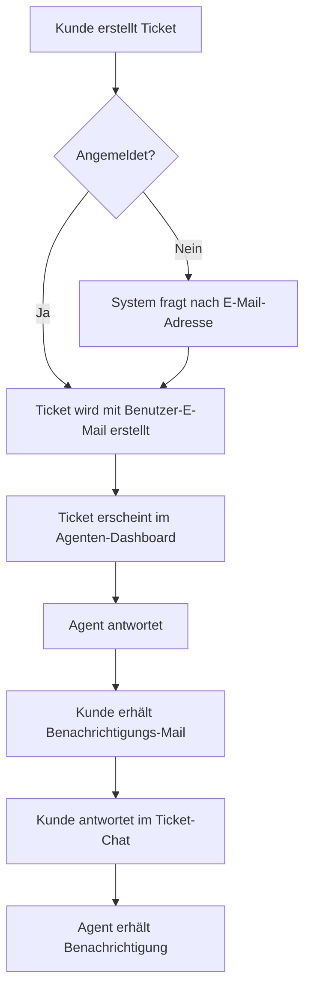

# Konzept- und Systemdokumentation: Schul-Support KI

Diese Dokumentation beschreibt die Funktionsweise und Architektur des erweiterten Schul-Support-Systems basierend auf den neuen Anforderungen.

---

## 1. Systemübersicht

Die Anwendung ist ein lernfähiges IT-Support-System für Schulen mit Ticketsystem und KI-Unterstützung. Es gibt drei Benutzerrollen:

1. **Kunde (Customer / Gast / Angemeldet):**
   * Kann direkt mit dem Bot chatten.
   * Kann Tickets erstellen (falls nicht angemeldet, wird die E-Mail abgefragt).
   * Kann Magic Links per Mail anfordern, um seine Ticket-Historie einzusehen.
2. **Agent:**
   * Besitzt ein Dashboard zur Verwaltung offener und aktiver Tickets.
   * Kommuniziert direkt mit dem Kunden im Ticket-Chat.
   * Kann interne Vermerke anlegen und Tickets an Kollegen weiterleiten.
   * Schließt Tickets unter Angabe einer Lösung (dies speist das KI-Gedächtnis).
3. **Admin:**
   * Verwaltet die Wissensdatenbank der KI (Chunks bearbeiten, löschen, manuell anlegen).
   * Importiert Dokumente/Webseiten zur KI-gestützten Analyse (Generierung neuer Chunks).
   * Konfiguriert SMTP/Maildev, den Identity Provider (IdP) und GitHub-Web-Updates.

---

## 2. Architektur & Komponenten

Das System ist als Next.js-Anwendung strukturiert:

* **Frontend:** React-Komponenten mit Tailwind CSS.
* **Backend:** Next.js API Routes (Node.js) für sicheren Datenzugriff, Mailversand und Gemini-API-Calls.
* **Datenbank:** SQLite (`better-sqlite3` oder `sqlite3` mit Node-Wrapper) zur lokalen Datenhaltung von Chats, Tickets, Benutzern und Einstellungen.
* **E-Mail-Server:** SMTP-Schnittstelle. Für lokale Entwicklung ist **Maildev** vorkonfiguriert.
* **Authentifizierung:**
  * **IdP (JWT Redirect):** Agenten/Admins loggen sich über einen IdP ein. Die Anwendung empfängt den JWT, validiert diesen und erstellt ein Session-Cookie.
  * **Magic Link:** Kunden erhalten bei Bedarf einen zeitlich begrenzten Token per E-Mail, der sie als Gast-Besitzer ihrer Tickets authentifiziert.

---

## 3. Funktionsweise der KI-Steuerung & Wissensdatenbank

### A. Chatbot (`gemini-2.5-flash`)
Vor jedem API-Aufruf liest die App die relevanten Wissenschunks aus der Tabelle `knowledge` und übergibt sie als Kontext im Prompt.

### B. Import und Deduplizierung (`gemini-1.5-pro` / `gemini-2.5-pro`)
* Wenn ein Ticket geschlossen oder ein Dokument/URL hochgeladen wird, extrahiert die KI Wissenschunks.
* Jeder extrahierte Chunk wird mit bestehendem Wissen abgeglichen. Die potente KI entscheidet, ob ein Chunk bereits existiert oder neu ist, um Duplikate zu vermeiden.

---

## 4. Ablaufdiagramme

### A. Authentifizierung & Rollen-Verteilung

### B. Ticket-Eskalation & Kommunikation

